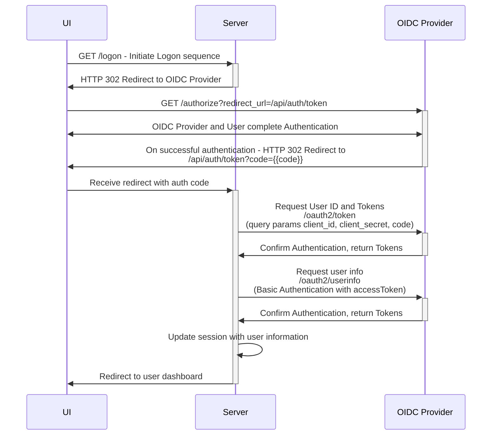
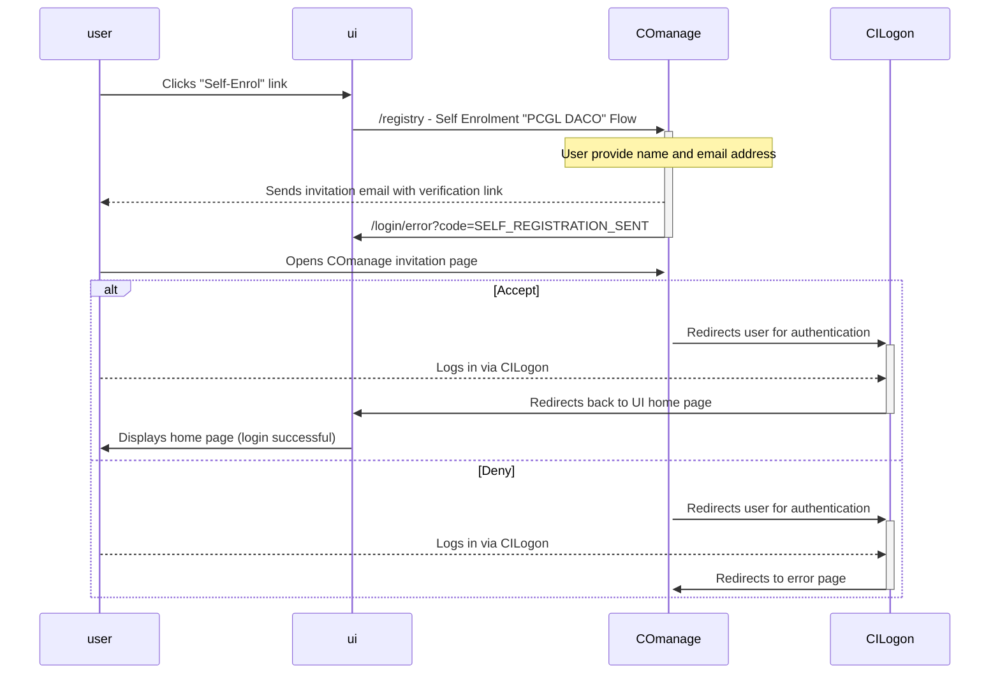

# Authentication and Sessions for PCGL DACO

PCGL DACO relies on an OIDC Provider to perform authentication for all users. When users Logon in the DACO UI, they will be redirected to the OIDC provider to authenticate. This uses the OIDC Authorization Code flow.

Following successful authentication, their user identity and relevant access tokens will be stored on the server in session data. Session data is kept mostly private to the API server, but a summary of User display and role information is available for use by the UI. The UI will use this information to display the user's name, and determine which pages they should have access to.

## Logon Authorization Flow

## User Self-Enrolment Flow

## Dependencies
In order to run the authentication flow, an OIDC provider is required. Additionally, a private client needs to be registered with the provider and the client_id and client_secret be added to the DACO API configuration.

- cilogon client setup
- redirect url

## Auth for Developers
For those running this software from the source, an OIDC Provider is not currently included through the docker-compose dependencies nor the default [`.env.schema`](../../apps/api/.env.schema). For this reason, the API can be run with auth disabled (the default configuration value).

The env property `ENABLE_AUTH` needs to be set to `true` in order for the authentication endpoints to function. If auth is enabled, the complete set of auth configuration variables will be required to be set for the API to startup.

## Sessions

After logging in, the server fetches User identity and permission data from the OIDC provider. This information is stored on the server in session data. The session data is [stored in a Valkey instance](#session-storage).

Sessions have a default lifespan set to 30 minutes. Session lifespan is extended by any user interaction with the DACO API server, which will be most page interactions on the DACO website.

Each session has a unique session token that is exchanged with the user agent through a secure, http-only cookie.

A session is created on every interaction with the API, even for anonymous users that have not authenticated.

Sessions are used to store information about the user that is logged in. After a user logs in, their access tokens and user information is stored on the server for use by the DACO application.

Session data is removed completely when the user logs out.

### Session Config

- Secret rotation
- max age
  - should be as long as oidc refresh token (or longer)

### Session Storage

Sessions are managed by [`express-session`](https://www.npmjs.com/package/express-session) library. The session data is stored in [Valkey](https://valkey.io/). Valkey is an open-source successor to Redis, forked from the Redis code base and compatible with the existing Redis client libraries. It is an in-memory, key-value data store that works well for fast data storage and retrieval, such as with user session data.

An instance of valkey is configured to run in the project [docker-compose](../../docker-compose.yml) file. The provided developer setup instructions will run this dependency.

Sessions do not interact with the Postgres DB.

### Interacting with Session Data on the API

- session middleware
	- valkey client
- accessing session info on req.session
- setting session structure in session middleware
	- keep root level session properties as optional (since the default session is empty)

The ExpressJS server uses the express-session middleware on all requests. This results in session information being available with every request.

### Interacting with User Data on the UI

- user endpoint
- user role (anonymous, applicant, dac member, )
- protected routes

By default, session information is not availabe to the UI. It is only available on the server.

Some of the user data is required by the UI in order to determine if the user has access to specific pages. For this purpose, the endpont `/api/auth/user` is available to retrieve user information. This User data endpoint **does not return all session info**, it only provides visibility into a select set of user information that is safe for interaction with the browser. This includes 
