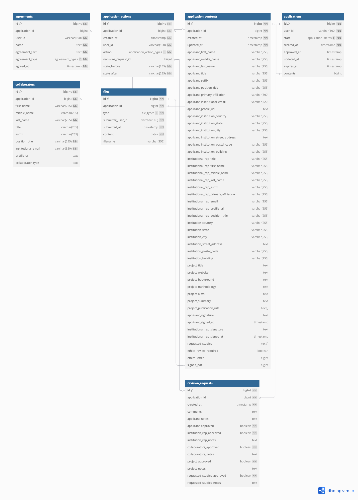

# PCGL DACO Data Model

## Entities
### Applications

The DACO data model is centered around `applications`. `applications` store which user created them and what state they are in based on the DACO Application Finite State Model.

> [!NOTE]
> Users are not tracked in the DACO DB. User identity and data management is not the purpose or scope of this application. Instead, when a User needs to be referenced, their UserID is stored instead. This is a string that is taken from the User identity used to identify and authorize the User as they interact with the DACO service. Several tables, including `applications` have a column for `user_id` which will store this token to identify the user.

### Application Content

The content of the application is tracked in `application_contents`. There is a column here for every field in the application form, and they are all stored as nullable data so that partial applications can be saved and reloaded as the user enters their data. There is 1 `application_content` record per application, and this entry is updated as the applicant modifies their application.

The `collaborators` table stores data on each collaborator attached to an application. If an individual is a collaborator on multiple DACO requests, they will have multiple entries in the `collaborators` table - one per application they are attached to.

The `files` table stores uploaded files connected to the application. This table includes meta-data about the file, and stores the contents of the file itself as a binary blob inside the `files.content` column.

### Application History and Reviews

`applications` have a `state` property that will update as a result of user actions, based on the DACO Application State Model. For example of actions, the applicant could create a new application, or submit it for review. A DACO admin could approve an application, request revisions on an application, or revoke a previously approved application.

A history of all actions taken on an application are stored in the `application_actions` table. The actions identify which user performed the action, what action was taken, when it occured, and what state transition resulted. If the action taken requested revisions of the application, then an entry is made into the `revision_requests` table. `revision_reqeuests` indicate which sections of the application are approved and which need revision, and can include text describing the revisions required.