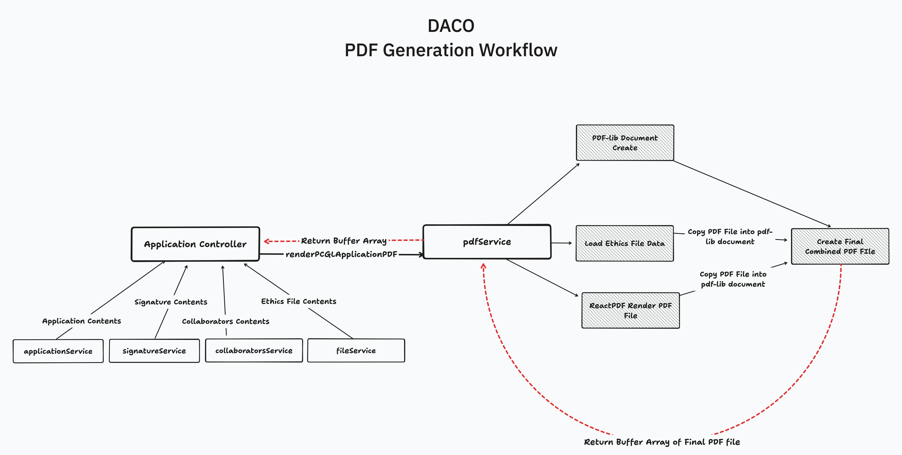

# DACO PDF Generation

As a part of the application process once the final step in the DACO cycle is completed (see: [DACO State Diagram](./states/DACO%20State%20Diagram.png)) and an application is approved by the Data Access Committee (DAC), the DACO backend will generate a PDF representation of approved PCGL application.

This generated PDF contains all of the information that an applicant filled out in their application including but not limited to: collaborators, contact information, requested studies, Research Ethics Board / Committee (REB / REC) approval/exemption letters and authorization signatures. This generated file is saved to the `files` table and associated with the application via the `application_id`. 

It is emailed out to the applicant and is also accessible via a API route.

## Technology

PDF, while a widely used format, is a surprisingly complicated file format to generate. Many PDF generation libraries operated entirely programmatically, meaning that we had to generate PDFs by specifying where elements should be placed via typed out X and Y coordinates. This likely would quickly become an issue for us since it is possible that new pages, elements or entirely new PDFs need to be generated in the future. 

Thankfully, a library called [`react-pdf`](https://react-pdf.org/) offers the ability to generate PDF files by specifying layouts via standard JSX. We opted to go with this route since it allowed us to have fine grained control over the look of our PDF and offered the best developer experience.

### `react-pdf`

`react-pdf` for the most part works similarly to how you'd create regular react components, however, there is one main key difference: **it does not support standard HTML elements.** 

This difference means that when creating elements you're limited to using `<View>` (similar to `
`), `<Text>` and `<Link>` along with some PDF primitives, such as `<Page>` and `<Document>`. These elements are always unstyled and unformatted. This means that without creating custom components, creating multiple PDF pages quickly becomes unruly.

### The (stripped down) DACO "Design System" & Component Library

Given the constraints of these unstyled elements, to maintain a consistent look for PDFs generated by DACO, a set of reusable React components were created which attempt to mimic the existing DACO design system. The components are as follows:

* `<StandardPage>` - A Canadian Letter page with predefined margins, ability to produce footers, and numbered pages. Props can disable things such as margins.
* `<Title>` - A `<Text>` element styled to look like a top-level heading.
* `<Paragraph>` - A `<Text>` element styled to look like a standard paragraph with the appropriate font and line-hight set to make it readable.
* `<FormDisplay>` - A subsection which includes a `<Text>` element styled as a `<h3>` with the appropriate margins to display items beneath it.
    * `<DataItem>` - Usually used within a `<FormDisplay>`, can display a horizontal line of data from, or display it vertically. Take in a title of the form item, and displays the data below or beside it.
* `<List>` - A ordered or unordered list. Can be adjusted via props.
* `<CollaboratorsTable>` - Given that tables are not natively offered, this element "fakes" a table and displays a collaborators. Can be modified in the future to expand beyond just collaborators.
* `<Signature>` - Element which displays a signature, takes in a base64 encoded image.
* `<Logo>` - The Pan-Canadian Genome Library Logo.

**Helpers & Other Items:**
* `standardStyling.ts` - Contains common styling constants:
    * `fonts`: Paths to font files
    * `sizes`: Font and spacing sizes used for consistent font and gap sizes for elements.
    * `colours`: PCGL theme colours.
* `/fonts/*` - Font files used for body and headings. LeagueSpartan is a Futura like font, which is used for the PCGL Logo and headers. Open Sans, which is sans serif font used on our frontend and paragraphs in the PDF/

### `PDF-lib`
While `react-pdf` is our main PDF generation library, it unfortunately does not support certain features, mainly combining PDF files, which is needed for appending on ethics documents to the end of the PCGL DACO app. To achieve this we use another PDF library called [`PDF-lib`](https://pdf-lib.js.org/). 

## Process Flow

Above is the workflow for how the full process for PDF Generation Works. The Application Controller function housing the PDF generation pulls in data from all services in the app. It then feeds the data from these services into `renderPCGLApplicationPDF`, a function exported by the `pdfService`. 

*Note: You must give it aliased objects, i.e the same object naming convention you'd send to the frontend (camel case vs. snake case), you must use here in the backend when calling the service since it too uses React*

### Appending PDF Files

Once the service has all of the required properties, it first renders the React PDF then, copies the PDF pages into a newly created `pdf-lib` document. This is a bit weird but PDF lib requires that pages be "copied" into a document for it to append things. So we create a new blank PDF doc using `pdf-lib` and copy the `react-pdf` doc into it. 

Next, we load the ethics PDF document and do the same, copying it into the `pdf-lib` document which the `react-pdf` document was copied into. Finally, we tell `pdf-lib` to render this new combined document and return it back to the PDF service, and then to the Controller.
