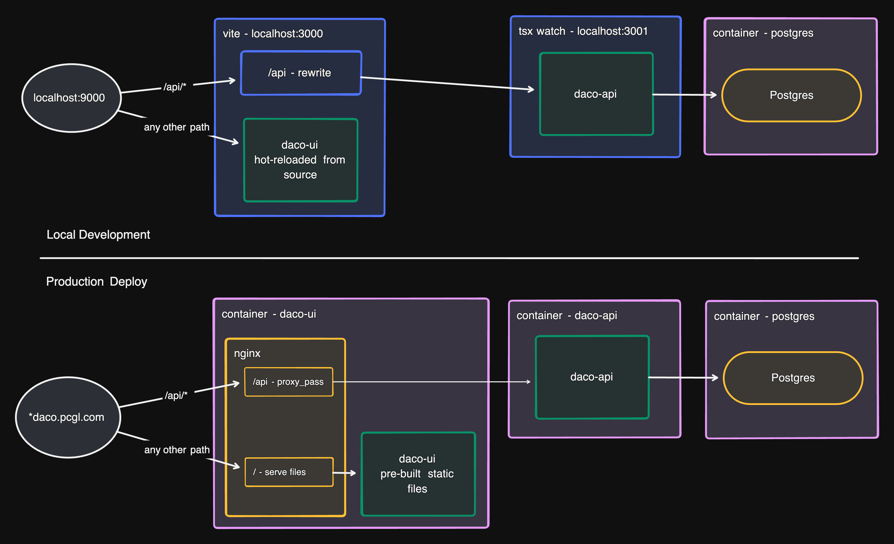

# UI and API Connection and Configuration

## Summary

The DACO API application provides for the DACO UI all dynamic data that drive the web application, as well as user authorization and session management. Consequently, we built the API application as a "Backend for Frontend" style server, providing HTTP endpoints designed to aggregate and organize data as needed to operate the application without the UI needing to be aware of how the backend systems are organized. The UI will only need to make web requests to this one server.

We have designed this application such that the UI can make requests to the API through the same web domain as the UI is hosted at. This is done by taking requests made to the UI's host server with a specified path (`/api/*`) and proxying them to the API.

The primary motivation is that this allows the static web application to know how to contact the API without requiring configuration for the environment it is deployed in. Since the UI is a statically built web app, after it is built there is no simple way to modify it based on the environment it is running in.

### Managing Configuration

For the DACO UI, there is a single environment variable that needs to be provided, that is the URL to use to proxy requests to the API: `API_URL`.

In development, this variable is set in the `/apps/ui/.env` file, as described in the [`/apps/ui/.env.schema`](../apps/ui/.env.schema). The default value `http://localhost:3001` will connect to the DACO API when running locally with the default configuration.

This variable is not required when building the DACO UI Docker image.

When running the DACO UI Docker image, the `API_URL` variable needs to be provided as an environment variable. When the Docker container starts, this variable will be used to update the nginx configuation to proxy requests to wherever the DACO API is hosted.

### The Proxy Path

Requests made to the UI host that start with `/api` will be passed through the the DACO API server. This path is hardcoded into the application since there was no need to modify it between environments, and there was not a clean way to manage it from a single variable.

This value is hardcoded in two places:

   1. [`vite.conf.ts`](../apps/ui/vite.config.ts) - This value is set as a `const` near the top of the Vite config file. It is used to setup the Vite server proxy, and it is defined as a global variable through the Vite config. This global variable is used by the data fetching code to definine the path to use for API requests. _This value will affect all deployments - it is used by the Vite dev server and is baked into the code at build time._
   2. [nginx.conf.template](../apps/ui/docker/nginx.conf.template) - This value is coded into the nginx config used by the Docker image produced at build time. _This value only affects deployments using Docker containers._

> [!IMPORTANT]
> If this path needs to change, make sure it is updated in all places it is hardcoded or the system may not work in both local and containerized deployments.

## Discussion of Alternatives

A common alternative that allows per-environment configuration of a statically built web app is to perform the build at deploy time. This allows all environment variables to be included into the built application, since we don't pre-build the app. This is the approach that most cloud hosting services (Netlify, Firebase, Vercel, etc.) take.

The DACO system has been designed to be built into a Docker images which will be deployed in a container orchestration system (kubernetes). In this setup, the app is built once, when the Docker image is created, and then that image ia deployed into several environments through a container management system. Running the build at deploy time would significantly complicate this process. In order to "build at deploy time", we could generate a new Docker image for every deployment, or have the application build script run inside the container when it starts. Neither of these are ideal setups. Both make deployment significantly slower as we would wait for the build to complete pre-deployment. If we include the build script in the image to run at startup time, then we will significantly increase the image's file size due to included dependencies. If we don't include dependencies in the image then builds could be flakey since they would rely on fetching dependencies from the web.

One workable alternative would be to have the image pre-built, but then to overwrite parts of the built code files at startup time to inject environment variables. This could be a useable solution to build into our Docker image, but adds significant complexity for little payoff. In fact, this is similar to how we modify the nginx config at startup time using environment variables - however, writing and maintaining our own script to modify the vite build files could introduce new challenges that we didn't face with nginx, which does the environment variable replacement out of the box.
